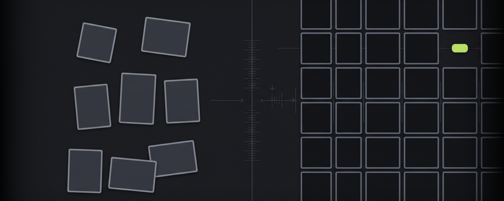

# Design Teardown

A Claude Code skill that compares any two products and turns the difference into a spec you can build.

Point it at a site you admire and your own. It measures both from live computed CSS, produces a token diff, ranks the fixes by visible effect per hour, and builds an interactive teardown page where every finding has a control you can drag.



## What it produces

**An interactive HTML page.** Not a report. Every finding is a live control: drag a slider to move letter spacing between the two measured values, press `B` to flip the entire document between "as measured" and "adjusted", step a card through three elevation levels, toggle a four layer drop shadow against an inset hairline, watch an accent counter drop from four uses to one.

**A Notion page**, if you have a Notion MCP connected. Same findings, structured with real Notion blocks, callouts, columns and a tickable work list.

## Install

Unzip it, then copy the skill folder into your skills directory:

```bash
unzip design-teardown-skill.zip
cp -r design-teardown-skill/design-teardown ~/.claude/skills/
```

Confirm it landed in the right place:

```bash
ls ~/.claude/skills/design-teardown/SKILL.md
```

Restart Claude Code, then:

```
/design-teardown https://linear.app https://mysite.com
```

Or just ask in plain language: *"compare my site to Linear and tell me what to fix."*

## Requirements

- Claude Code, or any agent that can run the skill format
- A browser tool the agent can execute JavaScript through
- Optional: a Notion MCP for the companion page, and an image tool for the cover

## Why it works

Three rules do the heavy lifting.

**Measure, never recall.** Without this instruction a model will describe what a site probably looks like from memory, fluently and incorrectly. Every number has to come off the live DOM or be marked unknown. The bundled probe (`scripts/measure.js`) does the extraction so there is nothing to invent.

**Take the discipline, not the identity.** The failure mode of design copying is becoming a worse version of someone else's brand. The skill is instructed never to recommend copying the reference's copy, marks, imagery or brand colour, and to explicitly leave alone anything of yours that is already strong.

**Label what needs a human.** A colour swap is a find and replace. Deciding what your hero should show is not. Keeping those in separate lists is the difference between a list that gets worked and one that gets admired.

## The worked example

`design-teardown/examples/glaido-vs-linear.html` is a complete real run, not a mockup. Open it in a browser and press `B`.

It measures [Glaido](https://bit.ly/4eGoI3R), a macOS voice dictation tool, against Linear. Both are dark developer facing products with a single bright accent, which is what makes them comparable. The teardown found that Glaido's architecture was already right and the gap was discipline: headlines tracked at roughly half the reference, cards and page set to the same value so borders did all the work, the accent used four times above the fold, and nine radii shipped against four declared.

> Trying Glaido: [bit.ly/4eGoI3R](https://bit.ly/4eGoI3R) with code `WHSAAKXO` gets you one free month.

## What is in the box

```
design-teardown/
  SKILL.md                              the workflow
  scripts/measure.js                    the measurement probe
  references/measurement-protocol.md    how to run it without getting empty results
  references/style-lock.md              the fixed visual system
  references/notion-structure.md        Notion block vocabulary
  assets/teardown-template.html         the interactive template
  examples/glaido-vs-linear.html        a complete real run
```

## Using the probe on its own

You do not need the skill to use the measurement script. Open any site, paste `scripts/measure.js` into the browser console, and you get a JSON breakdown of all nine dimensions.

Read `references/measurement-protocol.md` first. There is one trap that catches almost everyone: run it before the page has finished laying out and every element has a zero height box, so the filter drops all of them and you get a result with the right shape and empty arrays inside. It looks like the site has no borders or type rather than like an error.

## Licence

Use it, change it, ship it. No attribution required.
